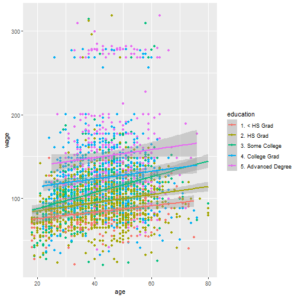

Developing Data Products - Final Course Project
========================================================
author: Werner Eduardo Garcia
date: 29/12/2020
autosize: true

Introduction
========================================================
Have you ever wondered how much your wage could be according to your age and educational level?

This shiny app will predict your Wage based on your input of these factors


Data of reference
========================================================
For doing this study we use the dataset Wage, this are the structure

```r
library(ISLR)
library(ggplot2)
data(Wage)

summary(Wage)
```

```
      year           age                     maritl           race     
 Min.   :2003   Min.   :18.00   1. Never Married: 648   1. White:2480  
 1st Qu.:2004   1st Qu.:33.75   2. Married      :2074   2. Black: 293  
 Median :2006   Median :42.00   3. Widowed      :  19   3. Asian: 190  
 Mean   :2006   Mean   :42.41   4. Divorced     : 204   4. Other:  37  
 3rd Qu.:2008   3rd Qu.:51.00   5. Separated    :  55                  
 Max.   :2009   Max.   :80.00                                          
                                                                       
              education                     region               jobclass   
 1. < HS Grad      :268   2. Middle Atlantic   :3000   1. Industrial :1544  
 2. HS Grad        :971   1. New England       :   0   2. Information:1456  
 3. Some College   :650   3. East North Central:   0                        
 4. College Grad   :685   4. West North Central:   0                        
 5. Advanced Degree:426   5. South Atlantic    :   0                        
                          6. East South Central:   0                        
                          (Other)              :   0                        
            health      health_ins      logwage           wage       
 1. <=Good     : 858   1. Yes:2083   Min.   :3.000   Min.   : 20.09  
 2. >=Very Good:2142   2. No : 917   1st Qu.:4.447   1st Qu.: 85.38  
                                     Median :4.653   Median :104.92  
                                     Mean   :4.654   Mean   :111.70  
                                     3rd Qu.:4.857   3rd Qu.:128.68  
                                     Max.   :5.763   Max.   :318.34  
                                                                     
```

Summary plot of the Data
========================================================




Links
========================================================

- shiny app:  https://wegm00.shinyapps.io/Proyecto/
- Source code: https://github.com/wegm00/developing-data-products-Fproject
